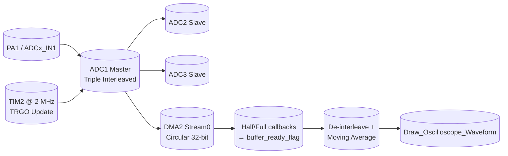

# Project MAD — STM32F767ZI Triple-ADC Interleaved Sampling

Firmware for a **triple-interleaved ADC** sampling engine on an **STM32F767ZIT6**, built with **STM32CubeIDE** (STM32Cube HAL, generated). Three ADCs (ADC1 master + ADC2/ADC3 slaves) sample the same analog pin in interleaved mode and stream results to a circular DMA buffer; the main loop de-interleaves, applies a moving-average filter, and hands the waveform to a (stub) draw routine.

> **Branch `triple-interleaved-v2`** is the current integration of the refined triple-interleave configuration (ported from `Tawan67/MAD`). `main` carries the earlier version that used the external `T2_TRGO` timer trigger and `ADC_CHANNEL_0` (PA0).

---

## 1. Target & Toolchain

| Item | Value |
|---|---|
| MCU | STM32F767ZIT6 (Cortex-M7) |
| CPU clock | 216 MHz (HSE → PLL 25×432) |
| Flash | 2 MB @ `0x08000000` |
| RAM | 512 KB @ `0x20000000` |
| Package | LQFP144 |
| IDE | STM32CubeIDE (GNU ARM / arm-none-eabi toolchain) |
| HAL | STM32F7xx HAL Driver (`Drivers/STM32F7xx_HAL_Driver`) + CMSIS |

---

## 2. Repository Layout

```
project-mad/
├── Project/                        # STM32CubeIDE project (main firmware)
│   ├── Project.ioc                 # CubeMX source of truth ("do not edit by hand")
│   ├── STM32F767ZITX_FLASH.ld      # Linker script (FLASH layout)
│   ├── STM32F767ZITX_RAM.ld        # Linker script (RAM layout)
│   ├── Core/                       # Generated + user application code
│   │   ├── Inc/                    #   - per-peripheral headers
│   │   │   ├── main.h              #     (empty — defines live in main.c)
│   │   │   ├── adc.h  dma.h  gpio.h  tim.h   # handles + MX_*_Init prototypes
│   │   │   ├── stm32f7xx_hal_conf.h          # HAL config switches
│   │   │   └── stm32f7xx_it.h                 # interrupt vectors
│   │   ├── Src/
│   │   │   ├── main.c              # ← ALL application logic (entry point)
│   │   │   ├── adc.c               # ADC1/2/3 init, triple-interleave, MSP
│   │   │   ├── dma.c               # DMA2 controller clock + IRQ enable
│   │   │   ├── tim.c               # TIM2 master trigger source
│   │   │   ├── gpio.c              # GPIOA/GPIOH clocks
│   │   │   ├── stm32f7xx_hal_msp.c # board-level MSP glue
│   │   │   ├── stm32f7xx_it.c      # default interrupt handlers
│   │   │   └── sysmem.c / syscalls.c / system_stm32f7xx.c  # stdlib stubs
│   │   └── Startup/
│   │       └── startup_stm32f767zitx.s   # reset vector / startup asm
│   ├── Drivers/                    # Generated, do not edit
│   │   ├── CMSIS/                  #   CMSIS headers + STM32F7xx device CMSIS
│   │   └── STM32F7xx_HAL_Driver/   #   STM32 Cube HAL sources + headers
│   └── .settings/  Debug/          # Eclipse/IDE metadata + build outputs
└── Lab-special-problem-3/          # UART command spec & mockup test notes
```

---

## 3. Data Flow



All three ADCs lock to the same analog input (**PA1 / `ADC_CHANNEL_1`**) and interleave their conversions. ADC1 is the DMA master; ADC2/ADC3 are slaves. On `HAL_ADCEx_MultiModeStart_DMA`, ADC1 pushes every sample into the circular DMA buffer.

---

## 4. Peripheral Configuration (from `Project.ioc` / generated `*_Init`)

### 4.1 ADC — Triple Interleaved (`adc.c`)
| Setting | Value |
|---|---|
| ADC1 (master) — Instance | `ADC1`, `ClockPrescaler` = `PCLK_DIV4` |
| Resolution | `ADC_RESOLUTION_12B` |
| Scan / Continuous | `ScanConvMode` = DISABLE, `ContinuousConvMode` = ENABLE |
| **Multi-mode** | `Mode = ADC_TRIPLEMODE_INTERL`, `DMAAccessMode = ADC_DMAACCESSMODE_2` (32-bit pack), `TwoSamplingDelay = 5 CYCLES` |
| Trigger | `ExternalTrigConvEdge = ADC_EXTERNALTRIGCONVEDGE_NONE`, `ExternalTrigConv = ADC_SOFTWARE_START` |
| DMA | `DMAContinuousRequests = ENABLE` |
| Channel (all 3 ADCs) | `ADC_CHANNEL_1` → **PA1 / `ADCx_IN1`** |
| Sampling time / rank | `ADC_SAMPLETIME_3CYCLES`, `REGULAR_RANK_1` |
| ADC2 / ADC3 | Same channel/sample time, **no DMA** (`DMAContinuousRequests = DISABLE`), configured with `DMAAccessMode_2` |

### 4.2 DMA — Circular ring buffer (`adc.c` MspInit, `dma.c`)
| Setting | Value |
|---|---|
| Instance | `DMA2_Stream0` |
| Direction | `DMA_PERIPH_TO_MEMORY` |
| Data alignment | Word / Word (32-bit) |
| Mode | `DMA_CIRCULAR` (ping-pong) |
| Priority / FIFO | `DMA_PRIORITY_VERY_HIGH`, `FIFO = DISABLE` |
| Request size | `DMA_BUFFER_SIZE` = **960** × 32-bit words (320 samples × 3 ADCs × 2 halves) |
| IRQ | `DMA2_Stream0_IRQn`, priority 0, enabled |

### 4.3 TIM2 — sampling master trigger (`tim.c`)
| Setting | Value |
|---|---|
| Instance | `TIM2` (APB1 clock → 54 MHz × 2 = **108 MHz** timer clock) |
| Prescaler / Period | `0` / `108-1` (→ **2 MHz** trigger) |
| Counter mode | `TIM_COUNTERMODE_UP` |
| Trigger | `TRGO_UPDATE`, `MasterSlaveMode = ENABLE` |

### 4.4 System clock — RCC (`main.c` / `Project.ioc`)
| Setting | Value |
|---|---|
| Oscillator | HSE, `HSE_BYPASS` (external clock source) |
| PLL | `PLLM=25`, `PLLN=432`, source HSE → SYSCLK **216 MHz** |
| Buses | APB1 `/4` = 54 MHz, APB2 `/2` = 108 MHz |
| Over-drive | `HAL_PWREx_EnableOverDrive()` |

### 4.5 MPU (cache-coherency safety)
`MPU_Config()` disables D-cache / bufferable on the DMA buffer region (`SubRegionDisable = 0x87`) so the CPU never reads stale cached DMA data — required on Cortex-M7 with a live DMA feed.

---

## 5. Application Logic (`main.c`)

```c
#define DISPLAY_WIDTH      320
#define DMA_BUFFER_SIZE    960   // 320 * 3 (double buffering)
#define FILTER_WINDOW_SIZE 5
```

Startup order in `main()`:
1. `MPU_Config()`
2. `HAL_Init()` → `SystemClock_Config()`
3. `MX_GPIO_Init()` → `MX_DMA_Init()` → `MX_ADC1_Init()` → `MX_ADC2_Init()` → `MX_ADC3_Init()` → `MX_TIM2_Init()`
4. `HAL_ADCEx_MultiModeStart_DMA(&hadc1, (uint32_t*)adc_dma_buffer, DMA_BUFFER_SIZE)` — single call arms the triple-interleave chain
5. `HAL_TIM_Base_Start(&htim2)` — start the 2 MHz trigger

Main loop (on `buffer_ready_flag`):
1. Copy `DISPLAY_WIDTH` raw samples from the ready half → `raw_waveform[]`
2. `Apply_MovingAverage()` (centered window, edge-truncated) → `filtered_waveform[]`
3. Refresh `debug_adc_raw` / `debug_adc_filtered` globals (SWD live-watch)
4. `Draw_Oscilloscope_Waveform()` — **currently a stub** (LCD draw commented out; hook ILI9341/DMA2D here)

DMA callbacks (`HAL_ADC_ConvHalfCpltCallback` / `ConvCpltCallback`) invalidate the DCache for the half just filled and flip `buffer_ready_flag`.

---

## 6. Build & Flash

```bash
# In STM32CubeIDE
#   File → Open Project → select Project/  →  Build (or Clean → Build All)
#   Debug: Debug/Project.elf  → flash via ST-LINK / CubeProgrammer
```

Or CLI:
```bash
cd Project
arm-none-eabi-gcc -v        # verify toolchain
# CubeIDE runs: .ioc → code generation → make
```

**Memory layout** (`STM32F767ZITX_FLASH.ld`): code + rodata → FLASH @ `0x08000000` (2 MB); data/bss/heap/stack → RAM @ `0x20000000` (512 KB). Min heap `0x200`, min stack `0x400`. Usage is a few KB — plenty of headroom.

---

## 7. Editing Rules (CubeMX regeneration)

- Edit peripherals in **CubeMX / `Project.ioc`**, then regenerate → CubeIDE rewrites `adc.c`, `tim.c`, `dma.c`, `gpio.c`, `Drivers/`.
- Keep application code inside main.c's `USER CODE BEGIN/END` sections so regeneration never overwrites it.
- Hand-editing generated `Core/Src/*.c` **outside** a `USER CODE` block will be lost on the next CubeMX generate.

---

## 8. Known Gaps / TODOs

- **`Draw_Oscilloscope_Waveform()` is a stub** — no ILI9341 LCD driver in this tree yet; real waveform rendering is the next step (per-pixel or DMA2D burst SPI).
- Filter window / display width / buffer size are hard-coded `#define`s (no UART runtime control in this branch).
- No UART shell or measurement/trigger modes — those belong to the Notion "Full Overview" spec and are not yet present in the committed source.
- `HSE_BYPASS` relies on an external clock source; switch back to `HSE_ON` if you run on the internal oscillator.
- Full oscilloscope feature-set (auto-scale, hold/cursors, frequency measurement, calibration) is documented in `Lab-special-problem-3/` mockup notes and the project Notion page, not yet ported to this branch.

---

## 9. Branch history

| Branch | Description |
|---|---|
| `main` | Earlier triple-interleave: `T2_TRGO` external trigger, `ADC_CHANNEL_0` (PA0), `uint32_t` buffer + cast |
| `triple-interleaved-v2` | **This branch** — refined: software-start, `ADC_CHANNEL_1` (PA1), `uint16_t` buffer, single `MultiModeStart_DMA` (this README) |
| `triple-interleaved` | Original feature branch merged into `main` via PR #1 |